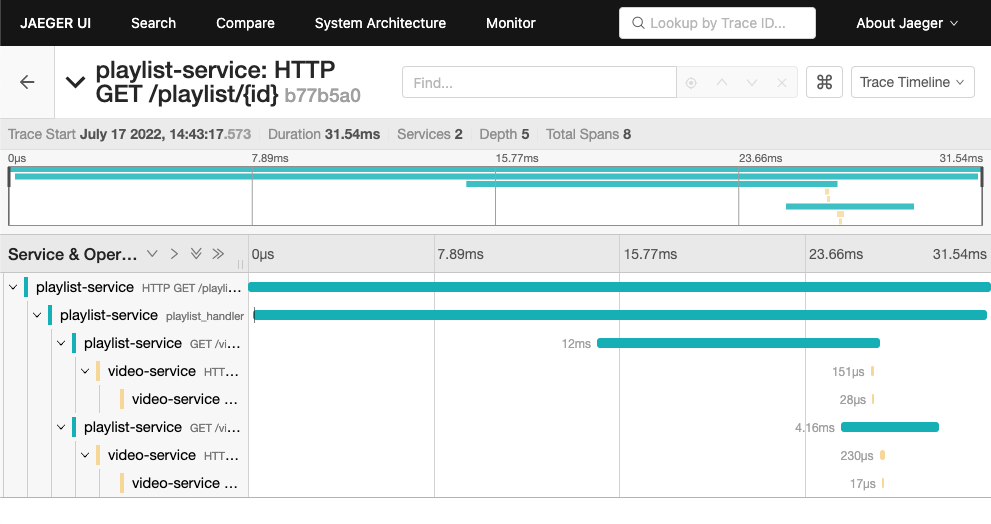

# Actix Opentelemetry



to demonstrate actix and open telemetry log + "distributed" tracing

## how to build playlist service image

```shell
cd playlist-service
docker build -t playlist-service -f docker/Dockerfile .
```

## how to build video service image

```shell
cd video-service
docker build -t video-service -f docker/Dockerfile .
```

## how to run with docker

```shell
docker network create actix_opentelemetry
docker run -d -p6831:6831/udp -p6832:6832/udp -p16686:16686 -p14268:14268 jaegertracing/all-in-one:latest
docker run -it --rm --name playlist-service --net actix_opentelemetry -p 8080:8080 -v "$(pwd)/docker/configuration.yml:/app/config/configuration.yml" playlist-service
docker run -it --rm --name video-service --net actix_opentelemetry -p 8081:8080 -v "$(pwd)/docker/configuration.yml:/app/config/configuration.yml" video-service
```

## how to create kubernetes deployment

```shell
cd playlist-service
kubectl -n mid create deploy --dry-run=client --image=your-registry/mid/playlist-service:0.0.1 -o yaml playlist-service > deployment.yaml
kubectl -n mid create configmap --dry-run=client --from-file=../config/configuration.yml -o yaml playlist-service-config > configmap.yaml
kubectl -n mid expose deploy playlist-service --name playlist-service --dry-run=client --type=NodePort --port 8080 -o yaml > service.yaml
kubectl -n mid create deploy --dry-run -o yaml --image=jaegertracing/all-in-one:latest jaeger > deployment-jaeger.yaml
kubectl -n mid expose deploy jaeger --name jaeger-service --dry-run=client --type=NodePort --port 8080 -o yaml > service-jaeger.yaml
cd ..

cd video-service
kubectl -n mid create deploy --dry-run=client --image=your-registry/mid/video-service:0.0.1 -o yaml video-service > deployment.yaml
kubectl -n mid create configmap --dry-run=client --from-file=../config/configuration.yml -o yaml video-service-config > configmap.yaml
kubectl -n mid expose deploy video-service --name video-service --dry-run=client --type=NodePort --port 8080 -o yaml > service.yaml
cd ..
```

## how to test with curl

```shell
$ curl -v http://192.168.1.10:8080/playlist/1                                                                                                                                                        ✔  
*   Trying 192.168.1.10:8080...
* Connected to 192.168.1.10 (192.168.1.10) port 8080 (#0)
> GET /playlist/1 HTTP/1.1
> Host: 192.168.1.10:8080
> User-Agent: curl/7.79.1
> Accept: */*
>
* Mark bundle as not supporting multiuse
< HTTP/1.1 200 OK
< content-length: 63
< content-type: application/json
< date: Sun, 17 Jul 2022 07:55:19 GMT
<
* Connection #0 to host 192.168.1.10 left intact
{"id":1,"videos":[{"id":1,"link":"111"},{"id":2,"link":"222"}]}
```
